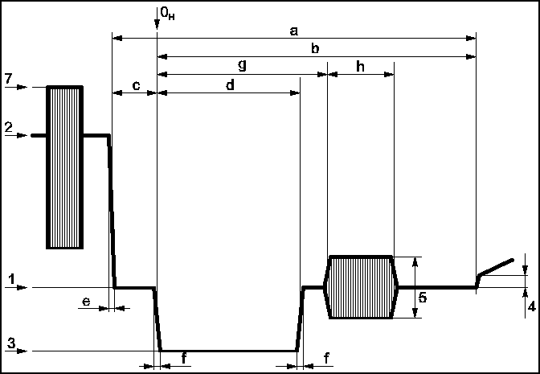
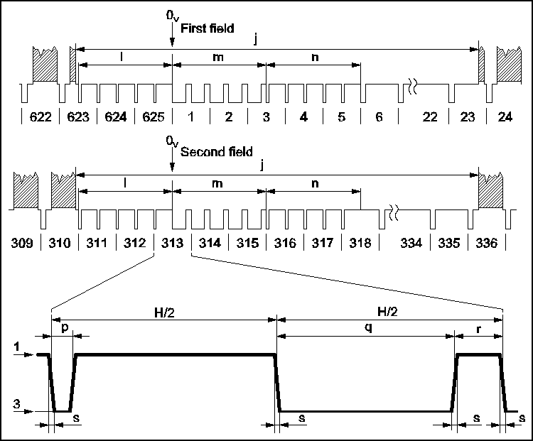
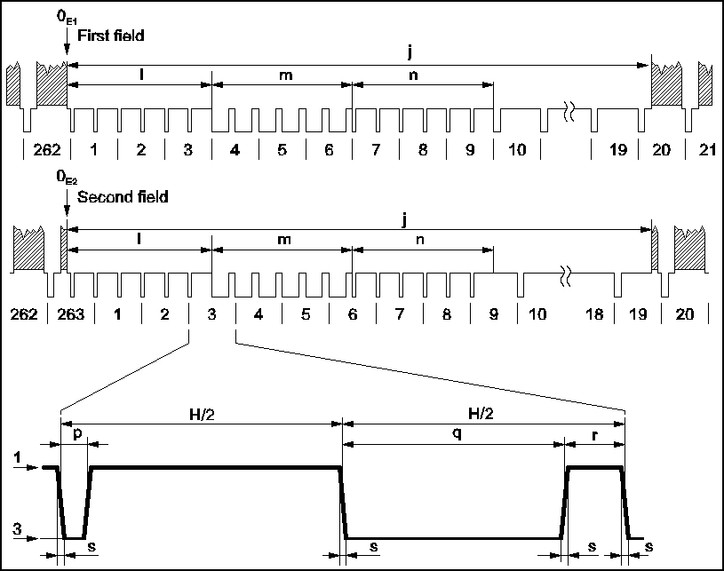

# Copy of kolumbus.fi/pami1

I am only doing this for archival purposes, now that the original website is offline.

The original website was at: http://www.kolumbus.fi/pami1/video/pal_ntsc.html

I do not know the identity of the original author.

# Characteristics of B,G/PAL and M/NTSC television systems

I have collected this information from Recommendation ITU-R BT.470-5 CONVENTIONAL TELEVISION SYSTEMS.

**Note!**

M/NTSC system implemented in Japan differs slightly from the description below.

I have dropped out most of the small exceptions to clarify the basic characteristics. I have not described the colour encoding principles. System B is used in VHF band and system G in UHF band.

## Basic Characteristics

**Basic characteristics of video and synchronizing signals**

| Characteristics | B,G/PAL | M/NTSC |
| -- | -- | -- |
| Number of lines per picture (frame) | 625 | 525 |
| Field frequency, nominal value (fields/s) | 50 | 59.94 |
| Line frequency fH | 15625±0.0001% | 15734.264±0.0003% |
| Assumed gamma of display device | 2.8 | 2.2 |
| Nominal video bandwidth (MHz) | 5 | 4.2 |

## Line Synchronizing Signal

**Nominal and peak levels of the composite video signal (%)**

Durations measured between half-amplitude points on the approriate edges

| Symbol | Characteristics | B,G/PAL | M/NTSC |
| -- | -- | -- | -- |
| 1 | Blanking level | 0 | 0 |
| 2 | Peak white-level | 100 | 100 |
| 3 | Synchronizing level | -43 | -40 |
| 4 | Difference between black and blanking levels | 0 | 7.5±2.5 |
| 5 | Peak-to-peak value of burst | 43±5 | 40±4 |
| 7 | Peak level including chrominance signal | 133 | 120 |

**Details of line synchronizing signals**

Build-up times measured between 10% to 90% of the pulse edges

| Symbol | Characteristics | B,G/PAL | M/NTSC |
| -- | -- | -- | -- |
| H | Nominal line period (µs) | 64 | 63.5555 |
| a | Line-blanking interval (µs) | 12±0.3 | 10.9±0.2 |
| b | Interval between time datum (0H) and back edge of line-blanking pulse (µs) | 10.5 | 9.2 to 10.3 |
| c | Front porch (µs) | 1.5±0.3 | 1.27 to 2.22 |
| d | Synchronizing pulse (µs) | 4.7±0.2 | 4.7±0.1 |
| e | Build-up time of the line blanking pulse (µs) | 0.3±0.1 | <0.48 |
| f | Build-up time of the line synchronizing pulse (µs) | 0.2±0.1 | <0.25 |
| g | Start of sub-carrier burst (µs) | 5.6±0.1 | 5.3 (4.71 to 5.71) |
| h | Duration of sub-carrier burst (µs) | 2.25±0.23 (10±1 cycles) | 2.23 to 3.11(9±1 cycles) |

## Field Synchronization of PAL System

**Details of B,G/PAL field synchronizing signals**

Durations measured between half-amplitude points on the approriate edges

Build-up times measured between 10% to 90% of the pulse edges

| Symbol | Characteristics | Value |
| -- | -- | -- |
| v | Field Period (ms) | 20 |
| j | Field-blanking interval | 25 H + a |
| j' | Build-up time of the edges of field-blanking pulse (µs) | 0.3±0.1 |
| k | Interval between front edge of field-blanking interval and front edge of first equalizing pulse (µs) | 3±2 |
| l | Duration of first sequence of equalizing pulses | 2.5 H |
| m | Duration of sequence of synchronizing pulses | 2.5 H |
| n | Duration of second sequence of equalizing pulses | 2.5 H |
| p | Duration of equalizing pulses (µs) | 2.35±0.1 |
| q | Duration of field-synchronizing pulses (µs) | 27.3 |
| r | Interval between field-synchronizing pulses (µs) | 4.7±0.2 |
| s | Build-up time of synchronizing and equalizing pulses (µs) | 0.2±0.1

## Field Synchronization of NTSC System

**Details of M/NTSC field synchronizing signals**

Durations measured between half-amplitude points on the approriate edges

Build-up times measured between 10% to 90% of the pulse edges

| Symbol | Characteristics | Value |
| -- | -- | -- |
| v | Field Period (ms) | 16.6833 |
| j | Field-blanking interval | (19 to 21) H + a |
| j' | Build-up time of the edges of field-blanking pulse (µs) | <6.35 |
| k | Interval between front edge of field-blanking interval and front edge of first equalizing pulse (µs) | 1.5±0.1 |
| l | Duration of first sequence of equalizing pulses | 3 H |
| m | Duration of sequence of synchronizing pulses | 3 H |
| n | Duration of second sequence of equalizing pulses | 3 H |
| p | Duration of equalizing pulses (µs) | 2.3±0.1 |
| q | Duration of field-synchronizing pulses (µs) | 27.1 |
| r | Interval between field-synchronizing pulses (µs) | 4.7±0.1 |
| s | Build-up time of synchronizing and equalizing pulses (µs) | <0.25 |

## Radiated Signal

**Characteristics of the radiated signal**

Levels in this table are % of peak carrier.

| Characteristics | B,G/PAL | M/NTSC |
| -- | -- | -- |
| Nominal RF channel bandwidth (MHz) | B:7   G:8 | 6 |
| Sound carrier relative to vision carrier (MHz) | +5.5±0.001 | +4.5 |
| Nearest edge of channel relative to vision carrier (MHz) | -1.25 | -1.25 |
| Nominal width of main sideband (MHz) | 5 | 4.2 |
| Nominal width of vestigial sideband (MHz) | 0.75 | 0.75 |
| Type and polarity of vision modulations | C3F neg. | C3F neg. |
| Synchronizing level (%) | 100 | 100 |
| Blanking level (%) | 75±2.5 | 72.5 to 77.5 |
| Difference between black level and blanking level (%) | 0 to 2 | 2.88 to 6.75 |
| Peak white level (%) | 10 to 15 | 10 to 15 |
| Type of sound modulation | F3E | F3E |
| Frequency deviation (kHz) | ±50 | ±25 |
| Pre-emphasis for modulation (µs) | 50 | 75 |

